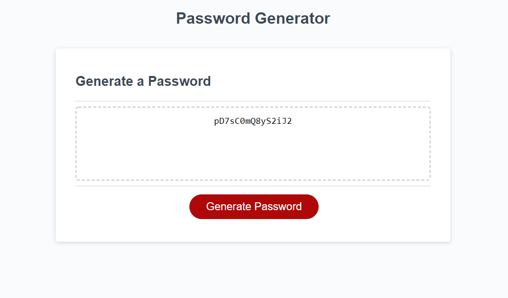

## Module-3-Challenge!

# Password Generator

* The following code in repository generates a random password for a user.
* The user is prompted with a sequence of questions asking about the length of the password,
  and if they want to include different type of characters such as  lowercase, uppercase, 
  numeric and special characters.
* As a result, our code generates a random password according to the response received from the user.

Deployed Application: https://jatin1211.github.io/Module-3-Challenge/
